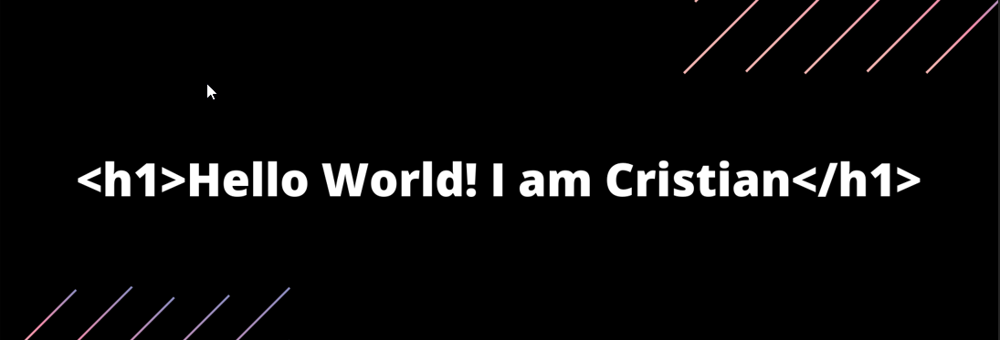

<h4> Vivo en Salta, norte de Argentina. Durante mi niñez pasaba largas horas frente al computador tocando y jugando con todo lo que pudiera. Al crecer me dediqué al estudio del español y la literatura, pero decidí darle un cambio a mi vida y comencé a estudiar programación. Quiero ser parte del mundo y de los avances tecnológicos, siempre hay tiempo para volver. </h4>

<h3 align="center">💼 Languages and Tools:</h3>

       

## &#x1f4c8; Stats

  
  

